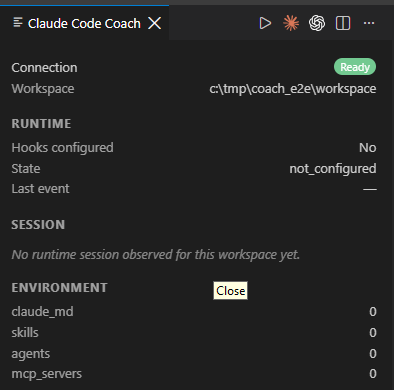
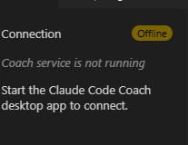
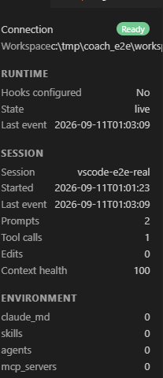

# Claude Code Coach

Workflow coaching for Claude Code developers, right inside VS Code.

> **Independent, community project.** Not affiliated with, endorsed by, or
> officially connected to Anthropic. "Claude" and "Claude Code" are
> Anthropic's products; this extension is a client that talks to a
> separate, locally-run companion application.

## What is Claude Code Coach?

Claude Code Coach is a local-first desktop app that observes your real
Claude Code CLI activity (via the hooks Claude Code itself supports) and
surfaces workflow coaching — prompt quality feedback, environment
awareness, runtime session signals — without ever sending your project to
a cloud service.

This extension connects VS Code to that **already-running desktop
application** over a loopback (`127.0.0.1`) connection, so you can see
your Coach's live status, connection state, and real runtime/session
information without leaving the editor.

## Features (this release)

- A **status bar** item showing the Coach's real connection state:
  `Connecting`, `Ready`, `Offline`, `Attention`, or `Paused` — never a
  fabricated or demo state.
- A **Coach panel** (`Claude Code Coach: Open Coach` in the Command
  Palette) showing:
  - Connection status and your current workspace
  - Runtime state (are Claude Code hooks configured, last event time)
  - **Current Coaching**: the single most relevant live coaching signal
    for your session right now (context health, search-first workflow,
    verification, etc.) — the same signal vocabulary the desktop app
    uses, not a separate or simplified one
  - Session summary (prompts, tool calls, edits, context health) for
    the current workspace, when a real session has been observed
  - A basic environment summary (Skills/Agents/CLAUDE.md/MCP counts)
- **`Claude Code Coach: Inspect Prompt`**: type a prompt and see a real
  Prompt Inspector pass — quality analysis, a suggested rewrite (with a
  one-click **Copy Suggested Prompt**), and an Approach Advisor
  recommendation — run by the same deterministic analyzer the desktop
  app uses, not a separate or simplified copy. Any Skill/Agent file the
  recommendation references can be opened directly (read-only) from the
  panel.
- **`Claude Code Coach: Pause Coaching`** / **`Resume Coaching`**, plus
  `claudeCodeCoach.coaching.notificationsEnabled` and
  `.notificationLevel` settings (`highOnly` / `highAndMedium` / `off`)
  to control native notifications independently of the panel.
- **`Claude Code Coach: Open Desktop Coach`**: tells you how to start the
  desktop app yourself — VS Code cannot locate or launch it
  automatically, so this is guidance, never an automatic startup.
- **Live updates**: the panel and status bar refresh automatically when
  new Claude Code activity is observed, via a lightweight local signal
  file plus a fallback poll — no need to manually refresh.
- **Automatic reconnection**: if the desktop app restarts, or wasn't
  running yet when VS Code started, the extension picks it up on its own.

**Not yet implemented in this release**: Skill/Agent **creation** and
Workshop Mode have no VS Code UI yet — creating a Skill/Agent (viewing an
existing one's file is supported, see above) and taking the Workshop
course remain desktop-only for now.

## How it works

```
VS Code Extension
        ↓  HTTP (127.0.0.1, token-authenticated)
Local Coach Service (embedded in the desktop app)
        ↓
Claude Code Coach Desktop Application
```

The extension is a **client**. All intelligence — prompt analysis,
environment discovery, runtime interpretation — lives in the desktop
application; the extension only displays what that application reports.

## Requirements

- **The Claude Code Coach desktop application must be running.** This
  extension has no functionality of its own without it — it is a window
  into the desktop app's state, not a replacement for it.
- Windows, macOS, or Linux with VS Code `^1.85.0` or later (the desktop
  app itself is developed and verified primarily on Windows).

## Install

This beta is distributed as a `.vsix` file rather than through the
Marketplace. See [Development](#development) for how to build one, then:

```powershell
code --install-extension claude-code-coach-0.3.0.vsix
```

## Quick Start

1. Start the Claude Code Coach desktop application.
2. Open a project folder in VS Code.
3. Check the status bar (bottom right) — it should read **Coach: Ready**
   within a few seconds.
4. Run **Claude Code Coach: Open Coach** from the Command Palette
   (`Ctrl+Shift+P` / `Cmd+Shift+P`) to see the panel.

## Desktop Coach Dependency

This extension **requires** the Claude Code Coach desktop application to
be running on the same machine. It does not implement any workflow
coaching intelligence itself.

If the desktop app is not running (or hasn't started listening yet), the
status bar shows:

```
Coach: Offline
```

and the panel explains: *"Coach service is not running. Start the Claude
Code Coach desktop app to connect."*

Once the desktop app starts, the extension detects it automatically —
usually within a few seconds — with no VS Code restart or reload needed.

## Privacy

- **Local-first.** The extension only ever talks to `127.0.0.1` — never
  any external server.
- **No cloud AI API calls** are made by this extension or the desktop
  Coach it connects to.
- **No telemetry.** Nothing about your usage is collected or transmitted
  anywhere, by this extension or the desktop app.
- **No remote prompt upload.** Your prompts and code never leave your
  machine through this integration.
- Environment data shown in the panel (Skills/Agents/CLAUDE.md/MCP
  counts) has already been redacted for secrets by the desktop app before
  it ever reaches this extension.

These claims describe the actual current implementation, not aspirational
goals — the full technical detail behind each one is documented in
`docs/VSCODE_INTEGRATION.md` in the project's source repository.

## Security

- The desktop app's local service binds to **`127.0.0.1` only** — never
  an externally-reachable address.
- Every request requires a random `X-Coach-Token` header, generated fresh
  each time the desktop app starts and shared only via a local discovery
  file with the same file permissions as the app's own database.
- This token is **defense-in-depth against another local process or user
  on a shared machine** — it is *not* a defense against a malicious
  process already running under your own Windows account, which could
  read the discovery file directly. That limitation is inherent to any
  unauthenticated-by-OS-user loopback service, on any platform.
- The extension never executes arbitrary code, shell commands, or file
  writes through this connection — every endpoint is read-only.

## Screenshots

All screenshots below are real captures from the actual extension running
against the actual desktop app (not mockups).

**Connected, showing real workspace and environment data:**



**Offline — desktop app not running:**



**A real, live runtime session:**



## Known Limitations

- Requires the desktop application; there is no standalone mode.
- No real-time push — updates arrive via a local file-change signal plus
  a periodic fallback poll, typically sub-second in practice but not a
  hard real-time guarantee.
- Multi-root VS Code workspaces use only the first folder as the active
  project.
- No Prompt Inspector, Approach Advisor, Skill/Agent creation, or
  Workshop Mode UI yet — desktop-only for now.
- Not published to the VS Code Marketplace yet; distributed as a `.vsix`
  during this beta.

## Troubleshooting

**Status bar stuck on "Offline"**
Confirm the desktop app is actually running. Check that
`%USERPROFILE%\.claude_code_coach\service.json` exists — if it's missing,
the desktop app's local service likely failed to bind its port (check the
desktop app's own log for a "could not bind" warning, usually because
another process already holds it).

**Panel shows stale data**
Run **Claude Code Coach: Open Coach** again to force a refresh, or check
`claudeCodeCoach.pollIntervalSeconds` in Settings isn't set unreasonably
high.

**Nothing happens after installing**
Reload the VS Code window (`Developer: Reload Window`) once after a fresh
install.

## Development

```powershell
cd vscode-extension
npm install
npm run compile
```

Press **F5** (with `vscode-extension/` open in VS Code) to launch an
Extension Development Host with the extension loaded.

### Build

```powershell
npm run compile
```

### Package

```powershell
npx vsce package
```

Produces `claude-code-coach-<version>.vsix` in this directory. See
`docs/MARKETPLACE_BETA_CHECKLIST.md`
before distributing it further.

### Tests

```powershell
npm test
```

## Release Process

This project is not yet published to the VS Code Marketplace. Publisher
identity (`ShashankHS`), the public repository
(https://github.com/Shashankhs3/claude-code-coach), and the license (MIT)
have all been decided. See `docs/MARKETPLACE_BETA_CHECKLIST.md` for what
else remains before a public release.

## Support

See [SUPPORT.md](SUPPORT.md) for how to report issues and known
limitations.

## License

MIT — see [LICENSE](LICENSE). Copyright (c) 2026 Shashank H S.
